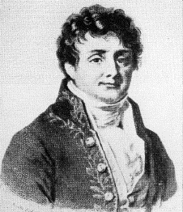

```{r setup, include=FALSE, message=FALSE, warning=FALSE}
knitr::opts_chunk$set(echo = TRUE)
```

```{r results='hide', message=FALSE, include=FALSE, warning=FALSE}
library(tidyverse)
library(cowplot)
library(shiny)
#setwd("C:/Users/erkso/Desktop/FFT")
```

# Intro

Being able to predict sub-surface soil temperatures accurately allows us to better understand the interactions of temperature with the biological components of the soil.  Soil temperature depends on periodic (daily and annual) energy inputs (from the air and from solar radiation, sometimes geothermal).  These temperature “waves” get damped down, or attenuated, with increasing depth in the soil, eventually reaching a constant temperature at a great depth.  That final deep temperature depends on the latitude, climate, and other conditions. 

A simple 1-dimensional model of heat conduction through the a solid [(Van Wijk and de Vries, 1966)](#refs) can be used to predict soil temperatures, as long as we have at least 1 day of temperature measurements (plus some other info).  Because the world is messy, parameters of the model can change with soil types and water content.  However, for a specific location and condition, we should be able to measure the surface temperature over at least one day and then calculate the soil temperatures at rooting depth, or some other important physiological/ecological depth.

This demonstration is based on work from this paper: [Graham et al. 2010](#refs).

Check out my other Shiny data project: [Exploring the Data: Who's Making News](https://erksome.shinyapps.io/WMN_Analysis/) or drop me a line: 'egraham.cens' at gmail!

***

# Explore Some Soil Temperature Data

First, let’s explore some real meteorological and soil temperature data from a NOAA weather station in Spokane, WA. The data are from: [ncei.noaa.gov/access/crn/qcdatasets.html](https://www.ncei.noaa.gov/access/crn/qcdatasets.html) from the good work by [Diamond et al. 2013, and Bell et al. 2013](#refs) and have already been cleaned up a bit. 

We will be using [R Statistical Software](#refs) (v4.3.1; R Core Team 2021) with both the "tidyverse" set of packages (to make data transformation and plotting easier and clearer) and the "shiny" package for some interactive data exploration.  Read in the R-formatted data with the `readRDS()` command and then display the first lines of the file using the `head()` function, like this:
```{r class.source = "fold-show", message=FALSE, warning=FALSE}
# Read in the data and examine the first 10 rows of data
soil_temps <- readRDS("soil_temps.RDS")
head(soil_temps, 10)
```

You should see a number of rows with column headings.  The first column is "Date_time", which obviously holds the date and time information.  The data are recorded every hour (each row). The second column is "solar", which holds the solar radiation hitting the soil surface in watts m^-2^. And then there are six more rows with "cm_" followed by a number.  The numbers represent the depth in the soil where the temperature, in degrees Celsius, was measured (so, "cm_0" is the soil surface temperature and “cm_05” is the temperature at 5 cm depth).

Let’s plot the entire year’s worth of soil surface temperatures:
```{r class.source = "fold-show", message=FALSE, warning=FALSE}
# Plot the surface temperature for the entire, annual data set
plot(soil_temps$Date_time, soil_temps$cm_0, "l")
```

That’s a lot of messy data, with the temperature of the surface rising and falling each day for 365 days.  What day of the year might have the largest diurnal (daily) temperature range?  Which might have the smallest?

Let's add another line, in red, on the plot that corresponds to the temperature measured at 5 cm depth in the soil:
```{r class.source = 'fold-show', message=FALSE, warning=FALSE}
# Plot the surface temperature again and add the temperature at 10 cm depth
plot(soil_temps$Date_time, soil_temps$cm_0, "l")
lines(soil_temps$Date_time, soil_temps$cm_05, "l", col="red")
```

It looks like the 5 cm depth line tracks the average daily temperatures, more or less.  The soil has also "smoothed out" the daily fluctuations, although there is still daily fluctuations and an annual rise-and-fall to the temperature in the soil.

To make the next set of plotting easier, first we'll rearrange our data and then use the "tidyverse" set of methods to subset and group the data.

To rearrange the data, we want the columns of different soil depths moved into a single column and then we'll add a new column of labels to identify which columns the data came from.  This will involve pivoting the data from "wide" (many columns, fewer rows) to "long" (fewer columns, many rows). We'll exclude the Date_time column from this transformation and make sure that the labels for the soil depths are defined as "factors" (recognized like labels or categories, not character strings).
```{r class.source = 'fold-show', message=FALSE, warning=FALSE}
# Pivot the data from wide to long
soil_temps_longer <- soil_temps |>
  pivot_longer(
    cols = !Date_time,
    names_to = "depth"
  ) |>
  mutate(depth = factor(depth, levels = c("solar", "cm_0", 
                                          "cm_05", "cm_10", 
                                          "cm_20", "cm_50", "cm_100")))
# Show the first 10 lines of the new, longer data set
head(soil_temps_longer, 10)
```

The structure of the data is now just three columns: Date_time, depth (the labels as factors), and value (the temperatures).

Plotting the data, especially when looking at two different depths, is now easier.  First, we subset the data by choosing three 24-hour periods in the summer and two depths, starting on the hour when the surface temperature is  at its lowest (more or less).  This will make it easier comparisons, later:
```{r class.source = 'fold-show', message=FALSE, warning=FALSE}
# Subset the data for three days in July and only the surface and 5 cm depths, start and end when the temperature is at its lowest, with a 2-minute wiggle for data time-stamp drift.
start_date <- mdy_hm("July 8, 2015 04:28", tz = "America/Los_Angeles")
end_date_3d <- mdy_hm("July 11, 2015 04:32", tz = "America/Los_Angeles")
end_date_1w <- mdy_hm("July 15, 2015 04:32", tz = "America/Los_Angeles")

soil_for_plotting <- soil_temps_longer |> 
  filter(Date_time >= start_date) |> 
  filter(Date_time < end_date_3d) |> 
  filter(depth == "cm_0" | depth == "cm_05")
```

Then, we plot this three-day subset of data using ggplot, grouping the two depths: (I've added some legends and things to the plot that are not part of the code below)
```{r class.source = 'fold-show', message=FALSE, warning=FALSE}
# Plot the subset of data
lineplot <- ggplot(soil_for_plotting, aes(x = Date_time, y = value, group = depth, color = depth)) + 
  geom_line() +
  theme_light() +
  theme(
    legend.position = "bottom",
    panel.border = element_blank(),
  ) +
  scale_color_manual(name="",
                     labels = c("Surface", "at 5 cm"), values = c("black", "red"))
```

(If you want to see the code for adding the legends and labels: click the "Show" button on the right.)
```{r, message=FALSE, warning=FALSE}
# Add titles
lineplot <- lineplot + 
  labs(
    title = "Soil temperatures",
    subtitle = "Spokane, WA",
    x = "Date", 
    y = "Degrees C"
  ) 

# Make theme prettier
lineplot <- lineplot + theme(
  panel.background = element_rect(fill = "white", colour = "white"),
  panel.grid = element_line(colour = "grey92"),
  panel.grid.minor = element_line(linewidth = rel(1)),
  axis.text.x = element_text(size=15),
  axis.text.y = element_text(size=15),
  axis.title.y = element_text(size=16),
  axis.title.x = element_text(size=16),
  plot.title = element_text( # font size "large"
    size = 18,
    hjust = 0, vjust = 1,
    margin = margin(b = 15/2)
  ),
  plot.subtitle = element_text( # font size "regular"
    size = 15,
    hjust = 0, vjust = 1,
    margin = margin(b = 15/2)
  ), 
  legend.title=element_text(size=14), 
  legend.text=element_text(size=14)
)

# Show the plot
lineplot
```

Looking at the plot above, it is clear that soil surface temperatures fluctuate more greatly than temperatures deeper in the soil.  The daily temperature "wave" at the surface decreases in amplitude the deeper you go (we'll see this better, below).

The wave at depth in the soil is also delayed in time - a phase-shift!  Looking at the plot above, when (what hour of the day) is the peak of the surface measurement (in black) compared to the peak of the 5 cm measurement on the same day (in red)?  Deeper in the soil, the peak should occur later in the day.  Here are the times of day for the maximum of the surface and 5 cm depth peaks:

* Peak time at surface: `r format(soil_for_plotting$Date_time[soil_for_plotting$value == max(soil_for_plotting$value[soil_for_plotting$depth == 'cm_0'])], format = "%H:%M")`
* Peak time at 5 cm depth: `r format(soil_for_plotting$Date_time[soil_for_plotting$value == max(soil_for_plotting$value[soil_for_plotting$depth == 'cm_05'])], format = "%H:%M")`

Rather than re-write the plotting code to examine other dates and compare other depths, a Shiny app can automate the process.  Below, we start on the same day as above, but display an entire week.  Check or un-check some variables and pick some date ranges to get a feeling for how the temperature "wave" passes through the soil and how it becomes damped and delayed with depth at different days of the year.  

As an added bonus, the solar radiation (W m^-2^) is also plotted in the top panel - check out how the soil temperature is affected by sunny days (a nice sunrise-to-sunset arc) or cloud cover (a more jagged line through the day).

## Interactive - Browse the data
```{r, echo=FALSE, message=FALSE, warning=FALSE}
inputPanel(
           checkboxGroupInput("include", 
                              "Include in the plot:",
                              choiceNames = list("0 cm surface", "5 cm deep",
                                                 "10 cm deep", "20 cm deep", 
                                                 "50 cm deep", "100 cm deep"),
                              choiceValues =list("cm_0", "cm_05", 
                                                 "cm_10", "cm_20", 
                                                 "cm_50", "cm_100"),
                              selected=c("cm_0", "cm_05")
           ),
           
           dateRangeInput("daterange",
                          "Dates for 2015 data:",
                          start = ymd("2015-07-08"),
                          end = ymd("2015-07-15"),
                          min = ymd("2015-01-01"),
                          max = ymd("2015-12-31"),
                          format = "mm-dd",
                          startview = "month",
                          weekstart = 0,
                          language = "en",
                          separator = " to ",
                          width = NULL,
                          autoclose = TRUE
           )
)

renderText({
  
  if(is.null(input$include)){
  "Please pick a depth to plot"
  }
    
})

# Equally spaced hues around the color wheel, starting from 15
# gg_color_hue <- function(n) {
#       hues = seq(15, 375, length = n + 1)
#       hcl(h = hues, l = 65, c = 100)[1:n]
# }

# Fixed pallet for depths
hues <- seq(15, 375, length = 6 + 1)
pal <- hcl(h = hues, l = 65, c = 100)[1:6]

# Get legends and colors.  Surface is always black, 5 cm always red
legendlabels <- function(depthslist, pal){
  leglabels <- NULL
  if(!is.null(depthslist)){
    for(i in 1:length(depthslist)){
      if(depthslist[i] == "cm_0"){
        leglabels <- c(leglabels, "Surface")
        pal[i] <- "black"
      } else if(depthslist[i] == "cm_05"){
        leglabels <- c(leglabels, "5 cm")
        pal[i] <- "red"
      } else if(depthslist[i] == "cm_10"){
        leglabels <- c(leglabels, "10 cm")
      } else if(depthslist[i] == "cm_20"){
        leglabels <- c(leglabels, "20 cm")
      } else if(depthslist[i] == "cm_50"){
        leglabels <- c(leglabels, "50 cm")
      } else if(depthslist[i] == "cm_100"){
        leglabels <- c(leglabels, "100 cm")
      }
    }
  }
  labelslist <- list("leglabels" = leglabels, "pal" = pal)
  return(labelslist)
}

renderPlot({
  
  # Get soil depths from input as a text string
  if(!is.null(input$include)){
    cond <- paste("depth == ", "'", input$include[1], "'", sep="")
    if(length(input$include) > 1){
      for(i in 2:length(input$include)){
        cond <- paste(cond, " | depth == ", "'", input$include[i], "'", sep="")
      }
    }
    
    # Get legend labels
    labelslist <- legendlabels(input$include, pal)
    
    # Filter on date range
    startdate <- input$daterange[1]
    enddate <- input$daterange[2]
    if(enddate < startdate){
      tempdate <- startdate
      startdate <- enddate
      enddate <- tempdate
    } else if(enddate == startdate){
      enddate = startdate + days(1)
    }
    
    soil_for_plotting_shinyS <- soil_temps_longer |>
      filter(Date_time >= startdate & Date_time < enddate) |>
      filter(eval(parse(text=cond)))
    
    soillineplot <- ggplot(soil_for_plotting_shinyS, aes(x=Date_time, y = value)) + 
      geom_line(aes(group = depth, color=depth)) +
      theme_light() +
      theme(
        legend.position = "bottom",
        panel.border = element_blank(),
      ) +
      scale_color_manual(name="",
                         labels = labelslist$leglabels, values = labelslist$pal)
    
    # Add titles
    soillineplot <- soillineplot + 
      labs(
        x = "Date", 
        y = "Degrees C"
      ) 
    
    # Make theme prettier
    soillineplot <- soillineplot + theme(
      #legend.position="none",  # remove legend because tooltips will suffice
      panel.background = element_rect(fill = "white", colour = "white"),
      panel.grid = element_line(colour = "grey92"),
      panel.grid.minor = element_line(linewidth = rel(1)),
      axis.text.x = element_text(size=15),
      axis.line.x = element_line(linewidth=0.25),
      axis.text.y = element_text(size=15),
      axis.title.y = element_text(size=16),
      axis.title.x = element_text(size=16),
      plot.title = element_text( # font size "large"
        size = 18,
        hjust = 0, vjust = 1,
        margin = margin(b = 15/2)
      ),
      plot.subtitle = element_text( # font size "regular"
        size = 15,
        hjust = 0, vjust = 1,
        margin = margin(b = 15/2)
      ), 
      legend.title=element_text(size=14), 
      legend.text=element_text(size=14)
    )
    
    ######## Solar top graph #########
    
    solar_for_plotting <- soil_temps_longer |>
      filter(Date_time >= startdate & Date_time < enddate) |>
      filter(depth == 'solar')
    
    solarlineplot <- ggplot(solar_for_plotting, aes(x=Date_time, y = value)) + 
      geom_line() +
      ylim(0, NA) +
      theme_light() +
      theme(
        #legend.position = "none",
        panel.border = element_blank(),
      )
    
    # Add titles
    solarlineplot <- solarlineplot + 
      labs(
        x = "Date", 
        y = bquote("(W" ~ m^-2 ~ ")")
      ) 
    
    # Make theme prettier
    solarlineplot <- solarlineplot + theme(
      #legend.position="none",  # remove legend because tooltips will suffice
      panel.background = element_rect(fill = "white", colour = "white"),
      panel.grid = element_line(colour = "grey92"),
      panel.grid.minor = element_line(linewidth = rel(1)),
      axis.title.x = element_blank(),
      axis.text.x = element_blank(),
      axis.line.x = element_line(linewidth=0.25),
      axis.text.y = element_text(size=15),
      axis.title.y = element_text(size=16),
      plot.title = element_text( # font size "large"
        size = 18,
        hjust = 0, vjust = 1,
        margin = margin(b = 15/2)
      ),
      plot.subtitle = element_text( # font size "regular"
        size = 15,
        hjust = 0, vjust = 1,
        margin = margin(b = 15/2)
      ), 
      legend.title=element_text(size=14), 
      legend.text=element_text(size=14)
    )
    
    # Show the plots
    plot_grid(solarlineplot, soillineplot,
              nrow = 2,
              #labels = "NONE",
              label_size = 12,
              align = "v",
              rel_heights = c(1,3)
    )
  }
})
```
 
***

# Examine a Time Series Decomposition of Soil Temperature

'Time series' is a special case of data where each point is associated with a date or time, and usually there is some periodic or repeating pattern to the data.  This is exactly what we see in the temperature "wave" both at the soil surface and at different depths, increasing and decreasing in a daily fashion (and a yearly fashion in areas outside of the tropics).

A Seasonal-Trend Decomposition ([Cleveland, 1979](#refs)), can be constructed from a time series and it results in three components: a trend component T~(m)~, a seasonal component S~(m)~, and a remainder R~(m)~, sometimes referred to as the irregular or random component:

$$Y_{(m)} = T_{(m)} + S_{(m)} + R_{(m)}$$

This type of analysis is often used in predicting trends in stock markets or housing prices but works nicely in Ecology as well.

Let’s look at our week’s worth of temperature data using a built-in Seasonal-Trend Decomposition time series function, `decompose()` (we can also use `stl()`, which is nearly identical).  

First, we must turn our data into a “time series” object that R can recognize.  To do this, we need to know the frequency of measurement (how many data points per period of time).  In our Spokane data, soil temperature was measured every hour.  So, if we want to look at the day level (a 24 hour period), we need to tell R to consider a frequency of 24 samples per day:
```{r class.source = 'fold-show', message=FALSE, warning=FALSE}
# Subset the data for seven days and only surface temperatures
time_series_data <- soil_temps_longer |>
  filter(Date_time >= start_date & Date_time < end_date_1w) |> 
  filter(depth == 'cm_0') |> 
  select(value)

# Make the data into a time series object 
time_series <- ts(time_series_data, frequency = 24)
```

Now, let’s 'decompose' our data and plot them:
```{r class.source = 'fold-show', message=FALSE, warning=FALSE}
# Seasonal Trend Decomposition
decomp_data <- decompose(time_series, "multiplicative") # can also use 'additive'

# Plot the data
plot(decomp_data)
```
 
The Decomposition output for our surface temperature data is four stacked plots: 

1.	**Observed** = the original data.
3.	**Trend** = shifts in average over a longer period than the seasonal data.
2.	**Seasonal** = the repeated data, the general "wave" of observed data.
4.	**Random** = “noise” that can’t be accounted for.

Look at the y-axis magnitudes.  The **Observed** data for this week ranges from about 10 to 60 degrees C.  The **Trend** ranges from about 29 to 33 degrees, the **Seasonal** ranges from about 0.5 to 2, and the **Random** from about 0.8 to 1.5.  We can multiply the Trend, Seasonal, and Noise values together to get back to the original, Observed data.  (if we had used 'additive' in the `decompose()` function, then we would add the Trend, Seasonal, and Noise to get back to the original data)

We now can see that soil temperature can be expressed as a periodic wave, plus longer-term trends, and some unaccountable noise in the system.

*** 

# Explore the Simple Soil Temperature Model

The temperature model for predicting temperatures at different depths is based on a "simple" physics equation (that does not initially look very simple), below:

$$T_{z} = \bar{T}^{surf} + \Delta T^{surf} \times e^{-z/d} + cos( \frac{2\pi t}{p} - \frac{2\pi t_{max}}{p} - \frac{z}{d})$$

where:

* $T_{z}$ is the temperature at the depth of interest, $z$.
* $\bar{T}^{surf}$ is the average temperature at the surface.
* $\Delta T^{surf}$ is the amplitude of the temperature "wave" at the surface.
* $e$ is Euler's number, the constant 2.71828...
* $d$ is the **damping depth**, a very special number, in centimeters.
* $z$ is the depth of interest in centimeters. $z$ always shows up divided by the damping depth $\frac{z}{d}$ and occurs twice in the equation.
* $cos( \frac{2\pi t}{p})$ is the cosine with time $t$ over the period $p$.
* $t_{max}$ is the time at which the maximum temperature is observed (to make things neater).
 
The **damping depth** is a special, often empirically-derived, number that controls how deep the temperature wave reaches into the soil.  It also controls the phase-shift (time delay) in the wave with depth.  The **damping depth** depends on soil conditions: its composition and moisture content (moisture is a big part).  

More technically, the **damping depth** is the depth where the temperature wave is 37% of the original at the surface (or reference depth).  This 37% is $\frac{1}{e}$ and shows up in a lot of models of physical and chemical phenomena.

It is also useful to think about the **damping depth** and the period of oscillation being positively correlated: if the period is long (a whole day of the sun heating the surface of the soil, for example), then the temperature wave will reach deep into the soil and the **damping depth** will be large.  If the period is very short, like a quick sun-fleck hitting the surface of the soil in a dense forest, then not much change in temperature will occur any deeper in the soil; the **damping depth** for this short period will be correspondingly small.

Let's play around with the model in another Shiny module, below.  Try changing the depth of interest, $z$, and the **damping depth**, $d$, to see how the temperature at depth, $T_{z}$ and phase-shift both change with a simple sine-wave temperature fluctuation at the surface (using values like a hot July day):

## Interactive - Explore the soil temperature model
```{r, echo=FALSE, message=FALSE, warning=FALSE}
# generate fixed surface temperature wave of three periods, like in middle of July for magnitude
tmodel = seq(pi, 7 * pi, 0.05)
p <- 2 * pi
surf = cos(tmodel) * 30 + 35
e <- exp(1)
  
inputPanel(
  sliderInput("depth", "Depth of interest, z:",
              min = 0, max = 100,
              value = 5, step = 1),
  
  sliderInput("dampdepth", "Damping depth, d:",
              min = 0, max = 20,
              value = 5, step = 0.25)
)
  
renderPlot({
  # Get depth and damping depth
  z <- as.numeric(input$depth)
  d <- as.numeric(input$dampdepth)
  if(d == 0){d <- 0.01}
  
  # equation is: Tz = mean(Tsurf)+amplitude(Tsurf)*e^(z/d)cos(2pi*t/p)
  Tz <- mean(surf) + (max(surf)-min(surf))/2 * e^(-z/d) * cos(2*pi*tmodel/p - z/d)
  
  modeldata <- as_tibble(cbind('time' = tmodel, 'surf' = surf, 'at_depth' = Tz))
  
  modeldata_longer <- modeldata |>
    pivot_longer(
      cols = !time,
      names_to = "depths"
    ) |>
    mutate(depths = factor(depths, levels = c("surf", "at_depth")))
  
  lineplot <- ggplot(modeldata_longer, aes(x = time, y = value, group = depths, color = depths)) + 
    geom_line() +
    theme_light() +
    theme(
      legend.position = "bottom",
      panel.border = element_blank(),
    ) +
    scale_color_manual(name="",
                       labels = c("Surface", "at Depth 'z'"), values = c("black", "red"))
  
  # add titles
  lineplot <- lineplot + 
    labs(
      title = "Model of surface temperature and at depth",
      x = "Time", 
      y = "Degrees C"
    ) 
  
  # make theme prettier
  lineplot <- lineplot + 
    theme(
      panel.background = element_rect(fill = "white", colour = "white"),
      panel.grid = element_line(colour = "grey92"),
      panel.grid.minor = element_line(linewidth = rel(1)),
      axis.text.x = element_text(size=15),
      axis.text.y = element_text(size=15),
      axis.title.y = element_text(size=16),
      axis.title.x = element_text(size=16),
      plot.title = element_text( # font size "large"
        size = 18,
        hjust = 0, vjust = 1,
        margin = margin(b = 15/2)
      ),
      legend.title=element_text(size=14), 
      legend.text=element_text(size=14)
    )
  
  # show the plot
  lineplot
})
```

Notice that the greater ("deeper") the damping depth, the larger the temperature changes at depth in the soil.  However, if you look deep enough (like at 100 cm, one meter), the temperature barely changes.  

How does our model compare to the actual soil temperatures?  If we look at those three days in July again and then make a model based on those same data (with the same mean and amplitude as the real data), we can plot the two on top of each other.  We'll also use a "guessed at" damping depth of 4 cm (more on that guess, below).  Let's see:
```{r, message=FALSE, warning=FALSE}
# Equation is as above: Tz = mean(Tsurf)+amplitude(Tsurf)*e^(z/d)cos(2pi*t/p)
# z is depth of interest, d is damping depth
# t is time, p is period

# Generate fixed surface temperature wave of three periods with same mean and amplitude as real data
soil_for_plotting_surf <- soil_for_plotting |> 
  filter(depth == "cm_0")

meanampsoilsurf <- soil_for_plotting_surf |> 
  summarise(mean = mean(value), amp = (max(value)-min(value))/2) 

# Generate the sine wave for the surface temperature of the model
time_adjust <- 3*(6*pi)/(24*3) # signal needs to start at minimum
tmodex = seq(pi + time_adjust,7*pi + time_adjust,(6*pi)/(24*3)) # 3 days of observations
p <- 2*pi
surfmodex = cos(tmodex) * meanampsoilsurf$amp + meanampsoilsurf$mean
e <- exp(1)
z <- 5
d <- 4 # a guess

# Model the temperature at depth
Tz <- meanampsoilsurf$mean + meanampsoilsurf$amp * e^(-z/d) * cos(2*pi*tmodex/p - z/d)

# Pivot longer, then combine the two data sets for plotting
modeldata <- as_tibble(cbind('Date_time' = soil_for_plotting_surf$Date_time, 'msurf' = surfmodex, 'mdepth' = Tz))

modeldata_longer <- modeldata |>
  pivot_longer(
    cols = !Date_time,
    names_to = "depth",
    values_to = "value"
  ) |>
  mutate(depth = factor(depth, levels = c("msurf", "mdepth")))

soil_and_model_for_plotting <- 
  rbind(soil_for_plotting, modeldata_longer)

# Plot the subset of data
lineplot <- ggplot(soil_and_model_for_plotting, aes(x = Date_time, y = value)) + 
  geom_line(aes(group = depth, color = depth, linetype = depth)) +
  theme_light() +
  theme(
    legend.position = "bottom",
    panel.border = element_blank(),
  )  +
  scale_colour_manual(values = c("black", "red", "black", "red"),
                      breaks = c("cm_0", 
                                 "cm_05", 
                                 "msurf", 
                                 "mdepth"),
                      labels = c("Surface", 
                                 "5 cm", 
                                 "Model surface", 
                                 "Model 5 cm")) +
  scale_linetype_manual(values = c("cm_0"="solid", 
                                   "cm_05"="solid", 
                                   "msurf"="dashed", 
                                   "mdepth"="dashed"),
                        breaks = c("cm_0", 
                                   "cm_05", 
                                   "msurf", 
                                   "mdepth"),
                        labels = c("Surface", 
                                   "5 cm", 
                                   "Model surface", 
                                   "Model 5 cm"))

# Add titles
lineplot <- lineplot + 
  labs(
    title = "Soil and modeled temperatures",
    subtitle = "Spokane, WA",
    x = "Date", 
    y = "Degrees C",
    color = "",
    linetype = ""
  ) 

# Make theme prettier
lineplot <- lineplot + theme(
  panel.background = element_rect(fill = "white", colour = "white"),
  panel.grid = element_line(colour = "grey92"),
  panel.grid.minor = element_line(linewidth = rel(1)),
  axis.text.x = element_text(size=15),
  axis.text.y = element_text(size=15),
  axis.title.y = element_text(size=16),
  axis.title.x = element_text(size=16),
  plot.title = element_text( # font size "large"
    size = 18,
    hjust = 0, vjust = 1,
    margin = margin(b = 15/2)
  ),
  plot.subtitle = element_text( # font size "regular"
    size = 15,
    hjust = 0, vjust = 1,
    margin = margin(b = 15/2)
  ), 
  legend.title=element_text(size=14), 
  legend.text=element_text(size=14)
)

# Show the plot
lineplot
```

Perhaps not great, but not too bad.  Any variation away from a regular sinusoidal pattern in the real world (especially that last day of the three) makes the model prediction worse.  How can we improve on this?

*** 

# The Fourier Transform
```{r echo=FALSE, out.width = '20%', out.extra='style="float:left; padding:10px"'}

```

A Fourier analysis "decomposes" a periodic complicated signal into a sum of simple sines and cosines (the results of the decomposition is a set of "complex numbers", with Real and Imaginary parts, but we can deal with those easily).

“Fourier series were introduced by Joseph Fourier (1768–1830; the dead guy to the left) for the purpose of solving the heat equation in a metal plate. It led to a revolution in mathematics…” - Wikipedia

What makes this so interesting is:

1. Our actual soil temperature is a complicated signal that can be represented (as Fourier demonstrated) as a series of simple sine waves added together.  
2. Our temperature model is just a simple sine wave calculation.  

**Thus, it should be easy to combine the series of sine waves with our model applied to each wave, improving on the model!**

## Practice: Deconstruct and reconstruct a complex signal

But first, let's demonstrate what the Fourier decomposition does with a signal that we create (so it's easier to see the relationship, how it works).  

Using the Shiny app below, you can create a complex signal (that might look like our soil temperature signal) from 3 sine waves, with a fixed offset of 0.3 (an arbitrary value). The period of the function is `2\pi`, the time it takes for one complete cycle. 

Adjust the magnitude and periods of each additive wave, below.  The period scale here is 0.5 = 4$\pi$, 1 = 2$\pi$, 2 = $\pi$, 3 = $\frac{2}{3}\pi$, 4 = $\frac{pi}{2}$, etc.  The equation used is $magnitude \times cos( \frac{2\pi t}{period})$  We are constructing a **Complex wave signal** in the "time domain" (like changes in temperature over time).

## Interactive - Construct and deconstruct {.tabset}
```{r, echo=FALSE, message=FALSE, warning=FALSE}
inputPanel(
HTML("First Sine wave input:"),
sliderInput(inputId = "magnitude_1",
                  label = "Magnitude of first sine wave",
                  min = 0, max = 1, step = 0.1,
                  value = 0.5),

sliderInput(inputId = "period_1",
                  "Period of first sine wave",
                  min = 0, max = 5, step = 0.5,
                  value = 3.5)
)
inputPanel(
HTML("Second Sine wave input:"),
sliderInput(inputId = "magnitude_2",
                  label = "Magnitude of second sine wave",
                  min = 0, max = 1, step = 0.1,
                  value = 0.3),

sliderInput(inputId = "period_2",
                  "Period of second sine wave",
                  min = 0, max = 5, step = 0.5,
                  value = 2.5)
)
inputPanel(
HTML("Third Sine wave input:"),
sliderInput(inputId = "magnitude_3",
                  label = "Magnitude of third sine wave",
                  min = 0, max = 1, step = 0.1,
                  value = 0.7),

sliderInput(inputId = "period_3",
                  "Period of third sine wave",
                  min = 0, max = 5, step = 0.5,
                  value = 5))
```

First, make a complex wave that you are happy with.

Next, look at the **Fourier decomposition** tab to see how the data are represented in the "frequency domain". What are the main frequencies of the signal that you created and their magnitudes?

### Complex wave signal
```{r, echo=FALSE, message=FALSE, warning=FALSE}
tFFT = seq(pi,3*pi, 0.01) 

renderPlot({

  # strange things were happening with period = 0
if(input$period_1 != 0){
  wave1 <- input$magnitude_1 * cos(input$period_1 * tFFT)
} else {
  wave1 <- 0
}
  if(input$period_2 != 0){
  wave2 <- input$magnitude_2 * cos(input$period_2 * tFFT)
} else {
  wave2 <- 0
}
  if(input$period_3 != 0){
  wave3 <- input$magnitude_3 * cos(input$period_3 * tFFT)
} else {
  wave3 <- 0
}
  
wave <- wave1 + wave2 + wave3 + 0.3

signal <- as_tibble(cbind('time' = tFFT, 'wave' = wave))

lineplot <- ggplot(signal, aes(x = time, y = wave)) + 
  geom_line() +
  theme_light() +
  theme(
    legend.position = "none",
    panel.border = element_blank(),
  ) 

# add titles
lineplot <- lineplot +
  labs(
    title = "Complex signal",
    x = "Time",
    y = "Degrees C"
  )

# make theme prettier
lineplot <- lineplot +
  theme(
    panel.background = element_rect(fill = "white", colour = "white"),
    panel.grid = element_line(colour = "grey92"),
    panel.grid.minor = element_line(linewidth = rel(1)),
    axis.text.x = element_text(size=15),
    axis.text.y = element_text(size=15),
    axis.title.y = element_text(size=16),
    axis.title.x = element_text(size=16),
    plot.title = element_text( # font size "large"
      size = 18,
      hjust = 0, vjust = 1,
      margin = margin(b = 15/2)
    ),
    legend.title=element_text(size=14),
    legend.text=element_text(size=14)
  )

# show the plot
lineplot
  
})
```

*** 

### Fourier decomposition
```{r, echo=FALSE, message=FALSE, warning=FALSE}

twopi <- parse(text = paste(2, "pi", sep = "*"))

renderPlot({

  # strange things were happening with period = 0
if(input$period_1 != 0){
  wave1 <- input$magnitude_1 * cos(input$period_1 * tFFT)
} else {
  wave1 <- 0 * cos(tFFT)
}
  if(input$period_2 != 0){
  wave2 <- input$magnitude_2 * cos(input$period_2 * tFFT)
} else {
  wave2 <- 0 * cos(tFFT)
}
  if(input$period_3 != 0){
  wave3 <- input$magnitude_3 * cos(input$period_3 * tFFT)
} else {
  wave3 <- 0 * cos(tFFT)
}

wave <- wave1 + wave2 + wave3 + 0.3

# a series of fractions of frequencies
freqs <- c("C", as.character(round(1/seq(1:10),2)))

lbls <- c("C", "2*pi", paste("2*pi", seq(2, 10), sep = "/"))
  
  # do an FFT of the wave & put into real values (remove imaginary)
  fft_wave <- as_tibble(fft(wave)) |> 
    mutate('value' = Mod(value)) |> 
    mutate('value' = value/length(value)) |> 
    slice(1:11) |> 
    mutate('lbls' = lbls) |> 
    mutate('harm' = seq(1:11))
  
  maxheight <- max(fft_wave$value)
  
  barplot <- ggplot(fft_wave, aes(x = harm, y = value)) +
  geom_col() +
    geom_text(aes(label = lbls), parse = T, vjust = -0.5, colour = "black", size=5) +
    ylim(0, maxheight + 0.05 * maxheight)
  theme_light() +
  theme(
    legend.position = "none",
    panel.border = element_blank(),
  ) 

# add titles
barplot <- barplot +
  labs(
    title = "Fourier decomposition",
    x = "Period",
    y = "Magnitude"
  )

# make theme prettier
barplot <- barplot +
  theme(
    panel.background = element_rect(fill = "white", colour = "white"),
    panel.grid = element_line(colour = "grey92"),
    panel.grid.minor = element_line(linewidth = rel(1)),
    axis.text.y = element_text(size=15),
    axis.title.y = element_text(size=16),
    axis.title.x = element_text(size=16),
    axis.text.x=element_blank(),
    axis.ticks.x=element_blank(),
    plot.title = element_text( # font size "large"
      size = 18,
      hjust = 0, vjust = 1,
      margin = margin(b = 15/2)
    ),
    legend.title=element_text(size=14),
    legend.text=element_text(size=14)
  )

# show the plot
barplot
})
```

The first column in the **Fourier decomposition** tab, labeled "C", is the constant, equal to our fixed offset of 0.3.

The second column is the longest period in our data set, 2$\pi$.  If one of the waves chosen has that period (a period of "1" on the slider), then this will be large in magnitude.  If not, it will be smaller.

The remaining columns are just fractions of the longest period, 2$\pi$, divided by 2, 3, 4, 5, etc., equivalent to shorter and shorter wavelengths.

Go back and try setting all the periods to the same value, for example "2" on the slider (equal to a period of $\pi$) and see how that is represented both in the "time domain" and the "frequency domain".  Or set each one to a different whole number.

*** 

## Reconstruct a real temperature wave from the components

As you might guess, you can also go the other way, to construct a complex signal from the Fourier decomposition components.  Depending on how many component periods you choose, the constructed signal will be a better and better fit to the original.  

Let's look at those days again in July when it started sunny, became partly cloudy, and the soil temperature was weird. However, let's use a data set with more points this time, a 10-minute measurement data set to allow a better estimate.  The data are plotted below to remind you.

The Fourier decomposition into its components has also already been done, below.  

The Constant offset is about 30 degrees and the 3-day and 1.5-day components are relatively small (seen in the inset panel).  The components in the main panel start with 24 hours, then that 24 hours is divided into smaller and smaller fractions (dividing by 2, by 3, by 4, ... ).  We only show the first 12 periods here (there are 72 in total for 10-minute, 24-hour data sets because of the number of measurements in a day).
```{r, message=FALSE, warning=FALSE}
# get the 10-minute data for the three days in July at the surface and the 5 cm depth
min_soil_temps <- readRDS('min_soil_temps.RDS')
min_soil_temps_3d <- min_soil_temps |> 
  mutate(Date_time = mdy_hm(Date_time, tz = "America/Los_Angeles")) |> 
  select(Date_time, Surf_Temp_C, Soil_Temp_5) |> 
  filter(as.POSIXct(Date_time, tz = "America/Los_Angeles") >= start_date) |> 
  filter(as.POSIXct(Date_time, tz = "America/Los_Angeles") < end_date_3d) |> 
  pivot_longer(
    cols = !Date_time,
    names_to = "depth"
  )

# take a look at the surface data
min_soil_temps_3d_surf <- min_soil_temps_3d |> 
  filter(depth == "Surf_Temp_C")

# a series of fractions of frequencies
lbls_3d <- c("C", "3d", "1.5 d", "24h", "12h", "8h", "6h")
lbls_24h <- c("24h", "12h", "8h", "6h", "4.8h", "4.0h", "3.4h", "3.0h", "2.7h", "2.4h", "2.2h", "2.0h")

# Do an FFT of the surface temperature & put into real values (remove imaginary, cut in half because output is symmetric)
fft_wave_3d <- as_tibble(fft(min_soil_temps_3d_surf$value)) |> 
  mutate('value' = Mod(value)) |> 
  mutate('value' = value/length(value))

fft_wave_24h <- fft_wave_3d |> 
  slice(4:15) |> 
  mutate('lbls' = lbls_24h) |> 
  mutate('harm' = seq(1:12))

fft_wave_3d <- fft_wave_3d |> 
  slice(1:7) |> 
  mutate('lbls' = lbls_3d) |> 
  mutate('harm' = seq(1:7))

# make a plot of the FFT
barplot <- ggplot(fft_wave_24h, aes(x = harm, y = value)) +
  geom_col() +
  geom_text(aes(label = lbls_24h), parse = F, vjust = -0.5, colour = "black", size=4) +
  theme_light() +
  theme(
    legend.position = "none",
    panel.border = element_blank(),
  )

# add titles
barplot <- barplot +
  labs(
    title = "Fourier transform",
    x = "Period",
    y = "Magnitude"
  )

# make theme prettier
barplot <- barplot +
  theme(
    panel.background = element_rect(fill = "white", colour = "white"),
    panel.grid = element_line(colour = "grey92"),
    panel.grid.minor = element_line(linewidth = rel(1)),
    axis.text.y = element_text(size=15),
    axis.title.y = element_text(size=16),
    axis.title.x = element_text(size=16),
    axis.text.x=element_blank(),
    axis.ticks.x=element_blank(),
    plot.title = element_text( # font size "large"
      size = 18,
      hjust = 0, vjust = 1,
      margin = margin(b = 15/2)
    ),
    legend.title=element_text(size=14),
    legend.text=element_text(size=14)
  )

### inset ###
# make a plot of the 3d FFT
inset3d <- ggplot(fft_wave_3d, aes(x = harm, y = value)) +
  geom_col() +
  geom_text(aes(label = lbls_3d), parse = F, vjust = -0.5, colour = "black", size=4) +
  theme_light() +
  theme(
    legend.position = "none",
    panel.border = element_blank(),
  ) +
  ylim(0,37)

# make theme prettier
inset3d <- inset3d +
  theme(
    panel.background = element_rect(fill = "white", colour = "white"),
    panel.grid = element_line(colour = "grey92"),
    panel.grid.minor = element_line(linewidth = rel(1)),
    axis.text.y = element_text(size=9),
    axis.title.y = element_blank(),
    axis.title.x = element_blank(),
    axis.text.x = element_blank(),
    axis.ticks.x = element_blank(),
    legend.title = element_blank(),
    legend.text = element_blank()
  )


# show the plots together
barplot + annotation_custom(ggplotGrob(inset3d), xmin = 5, xmax = 12, 
                       ymin = 5, ymax = 11)
```

Clearly, the largest influence on our temperature is the 24-hour daily cycle (apart from the Constant offset).  

To reconstruct the temperature "signal" $f(t)$ using just the components of the Fourier decomposition (above), we apply the following formula, summing up sines and cosines:

$$f(t) = F_{0} \phantom{.}\sum_{n=0}^{\text{max}\phantom{.}n}\phantom{.}[ 2a_{n}\cdot cos(n\phantom{.}\omega_{t}\phantom{.}t) - 2b_n \cdot sin(n\phantom{.}\omega_{t}\phantom{.}t)]$$
where:

* $F_{0}$ is the constant.
* $n$ is the component number.
* $a_{n}$ is the 'Real' part of the Fourier decomposition value.
* $b_{n}$ is the 'Imaginary' part of the Fourier decomposition value.
* $\omega$ = 2 $pi/period$.
* $t$ is the time.

Let's define a function with the `function()` command in R. This function will take 'n' number of Fourier decomposition components, plus a time and omega set of data, and return the reconstructed signal.  The rebuilding of the signal from the component pieces is known as Fourier synthesis:
```{r class.source = "fold-show", message=FALSE, warning=FALSE}
# This is the synthesis of the components in the "frequency domain" into the "time domain"
  synthesis <- function(n, fft_surf, omega, time) {
    synthesis = ((2 * Re(fft_surf[n]) * cos(omega * (n-1) * time)) - (2 * Im(fft_surf[n]) * sin(omega * (n-1) * time))) / length(fft_surf)
  }
```

Using the slider below, reconstruct the surface temperature signal from the components of the Fourier transform, using the synthesis function above.  Note that when the slider is on "0", it is just the constant offset (a flat line at about 30 degrees C).  How many components added up makes a "good enough" fit to the original data?  Is it ever exact?

## Interactive - Reconstruct the surface temperature
```{r, echo=FALSE, message=FALSE, warning=FALSE}
inputPanel(
  sliderInput("decimal", "Number of frequency components to use:",
              min = 0, max = 71, value = 0, step = 1),
  HTML("Slide the bar to the right to the value of '3'.  At this point, the curve below is the Constant plus the 3-day, 1.5-day, and the 24-hour periods."),
  HTML("With the slider var at a value of '6', this includes through the 6-hour period.")
)

renderPlot({
  
  sliderValue <- reactive({
    data.frame(
      Value = as.numeric(input$decimal))
  })
  
  componentvalue <- sliderValue()$Value + 1
  
  # ######## A wonderfully inefficient loop ########
  # # This will iterate through each component and add up the results
  # FFTLoop <- function(fft_surf, components, omega, time){
  #    F0 = Re(fft_surf[1]) / length(fft_surf)
  #    summation = F0
  #    if(components!=1){
  #       for(nn in 2:components) { 
  #           transform = ((2 * Re(fft_surf[nn]) * cos(omega * (nn-1) * time)) - (2 * Im(fft_surf[nn]) * sin(omega * (nn-1) * time))) / length(fft_surf)
  #           summation = summation + transform
  #       }
  #    } else {summation = rep(summation, length(time))}
  #   return(summation)
  # }
  # #################################################
  
  # set the period to be 73 hours (3 days)
  omega = 2 * pi / 72
  # set the time sequence to be 10-minute intervals of a day
  FFTtime = seq(0, 72, 24/144) # 10-minute intervals in a day
  # set the max components to use
  # this number will be half of the FFT results because they are symmetric
  n <- seq(1, componentvalue)
  
  # # do the Fourier Transform of the surface data
  fft_wave_3d <- as_tibble(fft(min_soil_temps_3d_surf$value))
  
  # apply the above function across all the components (instead of the loop)
  FFT_list <- lapply(n, synthesis, fft_surf = fft_wave_3d$value, omega, time=FFTtime)
  
  # sum up the results of the transformation
  # note:this could be done more efficiently as an "apply" function
  F0 <- Re(fft_wave_3d$value[1]) / length(fft_wave_3d$value)
  summation = rep(F0, length(FFTtime))
  if(length(n) >= 2){
    for(i in seq(2, length(FFT_list[]))) { 
      summation <- summation + unlist(FFT_list[i])
    }
  }
  
  # construct the tibble for plotting
  summation_date <- cbind(tibble("Date_time" = min_soil_temps_3d_surf$Date_time), tibble("depth" = "model"), tibble("value" = summation))
  summation_date <- rbind(summation_date, min_soil_temps_3d_surf)
  
  # plot the two lines
  lineplot <- ggplot(summation_date, aes(x=Date_time, y = value)) +
    geom_line(aes(group = depth, color = depth)) +
    ylim(0, 70) +
    theme_light() +
    theme(
      legend.position = "bottom",
      panel.border = element_blank(),
    ) +
    scale_colour_manual(values = c("red", "black"),
                        breaks = c("model", 
                                   "Surf_Temp_C"),
                        labels = c("Reconstructed", "Surface"))
  
  # add titles
  lineplot <- lineplot +
    labs(
      title = "Soil temperatures",
      subtitle = "Spokane, WA",
      x = "Date",
      y = "Degrees C",
      color = "",
      linetype = ""
    )
  
  # make theme prettier
  lineplot <- lineplot + theme(
    panel.background = element_rect(fill = "white", colour = "white"),
    panel.grid = element_line(colour = "grey92"),
    panel.grid.minor = element_line(linewidth = rel(1)),
    axis.text.x = element_text(size=15),
    axis.text.y = element_text(size=15),
    axis.title.y = element_text(size=16),
    axis.title.x = element_text(size=16),
    plot.title = element_text( # font size "large"
      size = 18,
      hjust = 0, vjust = 1,
      margin = margin(b = 15/2)
    ),
    plot.subtitle = element_text( # font size "regular"
      size = 15,
      hjust = 0, vjust = 1,
      margin = margin(b = 15/2)
    ),
    legend.title=element_text(size=14),
    legend.text=element_text(size=14)
  )
  
  # show the plot
  lineplot
})
```

We can get pretty darn close to the original surface signal adding up the FFT decomposition components (even better if there are a lot more samples per time unit).

*** 

# Combine the Soil Temperature Model with Fourier Decomposition to Improve on the Model

Look again at the "Soil and Modeled Temperatures" plot in Section 4.  The model isn't too bad if the day was clear, but it is even less accurate if the day was cloudy.  We can improve on that!

The temperature model we demonstrated only uses one "wave" to describe the soil temperature.  But as we have shown with the Fourier decomposition, there are multiple waves that make up the complex temperature signal.

If we apply our single-wave model to each wave component of a Fourier decomposition of the soil surface temperature, then we should be able to generate a much more accurate prediction of the temperature at depth.  But first, we need to understand the damping depth:

## A little about damping depth

We can calculate damping depth based on a known decrease in amplitude of soil temperatures measured at two depths (we can also do this with the delay, since the damping depth also occurs in the `cos()` function) .  We do this by re-arranging the model equation.  For example, the amplitude of the temperature wave at depth $z$ is equal to the amplitude of the temperature at the surface multiplied by $e$ with an exponent containing the reciprocal of the damping depth:

$$\Delta T_{z} = \Delta T^{surf} \times e^{-z/d}$$
(This is actually how we came up with the quick estimate of 4 cm used in the damping depth in the examples above)

Damping depth can also be calculated from soil physical properties, and here is where we can find a way to calculate the damping depth for the shorter "waves" in our Fourier decomposition.  Specifically:

$$d = \sqrt{\frac{2\text{ }\lambda \phantom{p}}{C\text{ }\omega}} = \sqrt{\frac{\lambda \text{ } period}{C\text{ }\pi}} = {\sf constant} \times \sqrt{period \phantom{p}}$$
where:

* $\lambda$ is the thermal conductivity of the soil.
* $C$ is the volumetric heat capacity of the soil.
* $\omega$ = 2 $pi/period$.
* (note that $\frac{\lambda}{C}$ = $\kappa$, the thermal diffusivity of the soil)

Our damping depth is thus proportional to the square root of the period and, assuming that the soil properties don't change within some measurement time (sometimes NOT a good assumption), then our damping depth for shorter periods is **equal** to a constant times the square root of the period.

If we know the damping depth for one period (and thus we know the constant), we can then calculate the damping depth for shorter periods (it's just a square root away).

Let’s start with our 4 cm estimate of the damping depth for the 24-hour period.

Damping depths for different frequencies are proportional to the square-root of the period (as above) and so we will construct a set of these damping depths, starting with a period of 3 days and proceeding to fractions of that: $\frac{1}{2}$, $\frac{1}{3}$ (our 24-hour period), $\frac{1}{4}$, $\frac{1}{5}$, etc.
```{r class.source = "fold-show", message=FALSE, warning=FALSE}
damp_24h = 4 # 4 cm, our first estimate for the 24-hour damping depth
reciprocals = c(3, 2, 1/seq(1:300))  # make a sequence of fractions (but account for the 3- and 1.5-day spans of the 3-day data, make those damping depths larger)
dampings = damp_24h * sqrt(reciprocals) # multiply the damping depth by the square roots of the fractions
print(round(dampings, 2)[1:10]) # display the damping depths to two decimals

```

See how the damping depths decrease?  The first damping depth is not for the daily, 24-hour period, but for the 3-day period.  The next is for the 1.5-day period.  Our 24-hour period is the third in line at 4.00 (that we are setting as our first "guess" at the damping depth).  The next is 2.83 cm for 12-hours, and so on.  Shorter periods of surface heating result in smaller damping depths and less "impact" on the temperatures at depth.

(Note: Even though the damping depth is larger for the longer periods of 3 and 1.5 days, the "impact" of those is not great on our surface or sub-surface temperature waves because of the Fourier magnitudes of those periods.  Look at the inset of the previous figure - the 3-day and 1.5-day periods don't contribute much to the overall temperature signal.)

## The Fourier soil temperature model

The parameters we need to use for our "improved" Fourier soil temperature model are the same as the simple model, except it now includes damping depths for each of the Fourier components of the complex wave.

Let's define an updated `function()` that combines the Fourier components with our simple model to make a Fourier soil temperature model:  

1. The First part of the Fourier soil temperature model, below, is the synthesis of the Real and Imaginary components of a Fourier decomposition into a sine wave (using the first function we defined, above).  
2. The Second part is gathering the parameters (like the exponent `-z/d`). 
3. The Third part of the function is our soil temperature model that takes each sine wave from Part 1 and predicts the temperature at a depth for that surface wave.
```{r class.source = "fold-show", message=FALSE, warning=FALSE}
# Our Fourier model as a function
fourier_model <- function(n, fft_surf, omega, time, dampings, z) {
  
  # First part: the transformation of the Fourier component into a wave
  wave <- synthesis(n, fft_surf, omega, time)
  
  # Second part: get the parameters of the soil model
  # get the amplitude
  dT <- (max(wave) - min(wave))/2
  # calculate the exponent from the depth and damping depth
  exponent = exp(-z/dampings[n-1])
  # the time at which the wave is maximum to shift. The first constant component, 
  #   there is no time, so we'll assign it a zero
  tmax <- 0
  tryCatch({
    tmax <- time[which(wave == max(wave[1:(length(wave)/(n-1))]))]
  },
  error = function(cond) {
    tmax <- 0
  })
  
  # Third part: our soil model estimate of temperature at depth z
  # NOTE: we don't need to add the mean temperature because that comes from the Fourier Constant
  depth_estimate <- dT * exponent * cos(omega * (n-1) * time - omega * (n-1) * tmax[1] - z / dampings[n-1]) 
  
  return(depth_estimate)
}
```

Then we will apply (using `lapply()`, or "list apply") our function across all the component waves of the Fourier decomposition and sum them up to get a more accurate estimate of the temperature wave at depth.  We will choose depth z = 5 cm to compare it to the actual value we have measured and our set of damping depths (with 4 cm as our damping depth for the 24-hour period):

Let's plot our measured (actual) temperature at 5 cm depth in red (as always), our first "simple" model estimate in dashed red, then our "improved" model in long-dashed blue: 
```{r, message=FALSE, warning=FALSE}
# set the period
omega = 2 * pi / 72
# set the time sequence to be 10-minute intervals of a day
FFTtime = seq(pi, 72+pi, 24/144) # 10-minute intervals
# set our depth of interest
z = 5

# do the Fourier decomposition of the surface data
fft_wave_3d <- as_tibble(fft(min_soil_temps_3d_surf$value))

# set the number of components to use.  The max number will be 
#   half of the FFT results because they are symmetric and second half is just a repeat
# start at 2 because first is the constant, applied later
n <- seq(2, length(fft_wave_3d$value)/2) 

# apply the above function across all the components (instead of the loop)
FFT_list_fourier <- lapply(n, fourier_model, fft_surf = fft_wave_3d$value, omega = omega, time = FFTtime, dampings = dampings, z = z)

# sum up the results of the transformation, skipping the results from the first component
#   note:this could be done more efficiently as an "apply()" function also!
# get the constant (not from the first component)
F0_fourier <- Re(fft_wave_3d$value[1]) / length(fft_wave_3d$value)
# repeat the constant for each time step
estimate0_fourier <- rep(F0_fourier, length(FFTtime))
# add up the rest for the "fourier_model" model
estimate_fourier <- estimate0_fourier
for(i in seq(2, length(FFT_list_fourier[]))) { 
  estimate_fourier <- estimate_fourier + unlist(FFT_list_fourier[i])
}

########################################################################################
# Get the simple model data by just using the 24-hour FFT component in our Fourier model
#   which is the 4th component (Constant, 3-day, 1.5 day, 24-hour).
# Damping is just 4 cm and the function looks at the last the fourth one in the list 
FFT_simple <- lapply(4, fourier_model, fft_surf=fft_wave_3d$value, omega, time=FFTtime, dampings=c(4,4,4,4), z=z)

# sum up the results of the transformation
#   note:this could be done more efficiently as an "apply" function
# get the constant
F0_simple <- Re(fft_wave_3d$value[1]) / length(fft_wave_3d$value)
# repeat the constant for each time step
estimate0_simple <- rep(F0_simple, length(FFTtime))
# get the first component, which will be the "simple" model
estimate_simple <- estimate0_simple + unlist(FFT_simple)
########################################################################################

# construct the tibbles for plotting
# first, the simple model
estimate_simple_date <- cbind(tibble("Date_time" = min_soil_temps_3d_surf$Date_time), tibble("depth" = "simple_model"), tibble("value" = estimate_simple))

# next the Fourier model
estimate_fourier_date <- cbind(tibble("Date_time" = min_soil_temps_3d_surf$Date_time), tibble("depth" = "fourier_model"), tibble("value" = estimate_fourier))

# Get the measured 5 cm depth for comparison
min_soil_temps_3d_5 <- min_soil_temps_3d |> 
  filter(depth == "Soil_Temp_5")

# combine with the surface data
estimate_all <- rbind(estimate_simple_date, estimate_fourier_date, min_soil_temps_3d_5, min_soil_temps_3d_surf)
  
# plot the lines
lineplot <- ggplot(estimate_all, aes(x=Date_time, y = value)) +
  geom_line(aes(group = depth, color = depth, linetype = depth)) +
  theme_light() +
  theme(
    legend.position = "bottom",
    panel.border = element_blank(),
  ) +
  scale_colour_manual(values = c("black", "red", "red", "blue" ),
                      breaks = c("Surf_Temp_C", "Soil_Temp_5","simple_model", "fourier_model"),
                      labels = c("Surface", "5 cm", "Simple Model", "Fourier Model")) +
  scale_linetype_manual(values = c("solid", "solid", "dashed", "longdash"),
                        breaks = c("Surf_Temp_C", "Soil_Temp_5","simple_model", "fourier_model"),
                      labels = c("Surface", "5 cm", "Simple Model", "Fourier Model"))

# add titles
lineplot <- lineplot +
  labs(
    title = "Soil temperature at 5 cm",
    subtitle = "Spokane, WA",
    x = "Date",
    y = "Degrees C",
    color = "",
    linetype = ""
  )

# make theme prettier
lineplot <- lineplot + theme(
  panel.background = element_rect(fill = "white", colour = "white"),
  panel.grid = element_line(colour = "grey92"),
  panel.grid.minor = element_line(linewidth = rel(1)),
  axis.text.x = element_text(size=15),
  axis.text.y = element_text(size=15),
  axis.title.y = element_text(size=16),
  axis.title.x = element_text(size=16),
  plot.title = element_text( # font size "large"
    size = 18,
    hjust = 0, vjust = 1,
    margin = margin(b = 15/2)
  ),
  plot.subtitle = element_text( # font size "regular"
    size = 15,
    hjust = 0, vjust = 1,
    margin = margin(b = 15/2)
  ),
  legend.title=element_text(size=14),
  legend.text=element_text(size=14)
)

# show the plot
lineplot
```

Is it improved?  Hard to say by just looking, so let's do a little subtraction: the mean absolute value of measured temperatures minus the model temperatures, at the 5 cm depth:

* Measured minus simple model: `r round(mean(abs(min_soil_temps_3d_5$value - estimate_simple)),2)` degrees C
* Measured minus Fourier model: `r round(mean(abs(min_soil_temps_3d_5$value - estimate_fourier)),2)` degrees C

Our Fourier model is indeed a little better!

*** 

# Account for Soil Inconsistencies and Seasonal Trends

Why is our Fourier model not perfect?  There are probably a number of reasons, but there are three that are most likely the biggest issues:

1. We made only an educated guess at the damping depth.
2. Damping depth is used twice in the equation, once for the actual "damping" of the amplitude of the temperature wave and the other for the "delay", the phase-shift, in the wave at depth.  In a uniform solid, this is probably OK, but for soil, sometimes they are not the same.
3. Longer time-scale changes.  For example, look at the first figure in this document and see how the average temperature changes with time over the course of a year.  Or, our choice of 3 days could have been for a short cooling period when the longer-term trend was warming.  This "seasonal" affect changes how accurately we can predict sub-surface temperatures if we model with only a few days of data.

## Separating the damping depth from the phase-shift and adding a trend offset

Let's make our Fourier model even better.  We'll accommodate the issues above by first replacing the second instance of the damping depth inside the cosine function with a separate "phase-shift" parameter (`ps`), because we don't necessarily want them to be identical.  We will also add a constant for our seasonal trend (`st`).  The new soil temperature model looks like this:

$$T_{z} = \bar{T}^{surf} + \Delta T^{surf} \times e^{-z/d} + cos( \frac{2\pi t}{p} - \frac{2\pi t_{max}}{p} - \frac{z}{ps}) + st$$
The Fourier "separated" function looks a little different than our first Fourier model function because we add one new parameter: phase-shift^[Our new phase-shift parameter is inside the cosine function, increasing the delay in the sub-surface temperature wave.  Because trigonometric functions don't "preserve" units, it doesn't really matter what units we give the new phase-shift parameter, and retaining the depth units does make the $\frac{z}{ps}$ unitless.  But the phase-shift also moves our estimate in time, so it might be useful (helpful? sane?) to think of our phase-shift in terms of "depth per period" or of "depth per time-shift".].  The seasonal trend offset will be handled at the end:
```{r class.source = "fold-show", message=FALSE, warning=FALSE}
# Our newest summation function with damping depth and delay depth separate
fourier_separate <- function(n, fft_surf, omega, time, dampings, phases, z) {
  
  # First part: the transformation of the Fourier component into a wave
  wave <- synthesis(n, fft_surf, omega, time)
  
  # Second part: get the parameters of the soil model, using damping depth
  # get the amplitude
  dT <- max(wave)
  # calculate the exponent from the depth and damping depth
  exponent = exp(-z/dampings[n-1])
  # the time at which the wave is maximum to shift. The first constant component, 
  #   there is no time, so we'll assign it a zero
  tmax <- 0
  tryCatch({
    tmax <- time[which(wave == max(wave[1:(length(wave)/(n-1))]))]
  },
  error = function(cond) {
    tmax <- 0
  })
  
  # Third part: our soil model estimate of temperature at depth z, using the new phase-shift
  depth_estimate <- dT * exponent * cos(omega * (n-1) * time - omega * (n-1) * tmax[1] - z / phases[n-1])

  return(depth_estimate)
}
```

To test this new model, we need to estimate the new phase-shift parameter and the offset for this particular time and soil condition.  To make our first guess, let's look at the previous figure with the Fourier model compared to the "ground-truth" temperature measured at 5 cm.  Upon examination, it appears that:  

1. The damping depth could be decreased a little, reducing the predicted temperature wave amplitude.

2. The phase-shift is off.  It is delayed too much because the peak of the Fourier modeled temperature is earlier than the peak of the temperature wave at 5 cm.

3. The average of the Fourier model seems a little high.

Considering these observations, use the sliders below to set some new guesses at a damping depth, phase-shift, and a seasonal trend offset to do better job for the separate model:

## Interactive - Separate model
```{r, echo=FALSE, message=FALSE, warning=FALSE}
inputPanel(
  sliderInput(inputId = "damping_input",
              label = "Damping depth (cm)",
              min = 0, max = 10, step = 0.1,
              value = 4.0),
  
  sliderInput(inputId = "phase_input",
              "Phase-shift",
              min = 0, max = 10, step = 0.1,
              value = 4.0),
  
  sliderInput(inputId = "offset_input",
              "Offset",
              min = -10, max = 10, step = 0.1,
              value = 0)
)

tFFT = seq(pi,3*pi, 0.01) 

renderPlot({
  
  phase_24h <- input$phase_input # estimate for the 24-hour phase-shift
  damp_24h <- input$damping_input # estimate for the 24-hour damping depth
  seasonal_trend <- input$offset_input # to shift our estimate
  
  reciprocals = c(3, 2, 1/seq(1:300))  # make a sequence of fractions (but account for the 3- and 1.5-day spans of the 3-day data, make those damping depths larger), as before
  phases_separate = phase_24h * sqrt(reciprocals) # multiply the damping depth by the square roots of the fractions
  dampings_separate = damp_24h * sqrt(reciprocals) # multiply the damping depth by the square roots of the fractions
  
  # apply the above function across all the components (instead of the loop)
  FFT_list_separate <- lapply(n, fourier_separate, fft_surf = fft_wave_3d$value, omega = omega, time = FFTtime, dampings = dampings_separate, phases = phases_separate, z = z)
  
  # sum up the results of the transformation
  #   note:this could be done more efficiently as an "apply" function
  # get the constant and the seasonal offset
  F0_separate <- Re(fft_wave_3d$value[1]) / length(fft_wave_3d$value) + seasonal_trend
  # get the first component, which will be the constant
  estimate0_separate <- rep(F0_separate, length(FFTtime))
  # add up the rest for the "improved" model
  estimate_separate <- estimate0_separate
  for(i in seq(2, length(FFT_list_separate[]))) { 
    estimate_separate <- estimate_separate + unlist(FFT_list_separate[i])
  }
  
  # construct the tibbles for plotting, using the old Fourier results and the measured 5 cm data
  # # first, the improved model
  # estimate_improved_date <- cbind(tibble("Date_time" = min_soil_temps_3d_surf$Date_time), tibble("depth" = "improved_model"), tibble("value" = estimate))
  # next the improved-separate model
  estimate_separate_date <- cbind(tibble("Date_time" = min_soil_temps_3d_surf$Date_time), tibble("depth" = "separate_model"), tibble("value" = estimate_separate))
  
  estimate_all <- rbind(estimate_separate_date, estimate_fourier_date, min_soil_temps_3d_5, min_soil_temps_3d_surf)
  
  
  # plot the lines
  lineplot <- ggplot(estimate_all, aes(x=Date_time, y = value)) +
    geom_line(aes(group = depth, color = depth, linetype = depth)) +
    theme_light() +
    theme(
      legend.position = "bottom",
      panel.border = element_blank(),
    ) +
    scale_colour_manual(values = c("black", "red", "blue", "purple" ),
                        breaks = c("Surf_Temp_C", "Soil_Temp_5","fourier_model", "separate_model"),
                        labels = c("Surface", "5 cm", "Fourier Model", "Separate Model")) +
    scale_linetype_manual(values = c("solid", "solid", "dashed", "longdash"),
                          breaks = c("Surf_Temp_C", "Soil_Temp_5","fourier_model", "separate_model"),
                          labels = c("Surface", "5 cm", "Fourier Model", "Separate Model"))
  
  # add titles
  lineplot <- lineplot +
    labs(
      title = "Soil temperature at 5 cm",
      subtitle = "Spokane, WA",
      x = "Date",
      y = "Degrees C",
      color = "",
      linetype = ""
    )
  
  # make theme prettier
  lineplot <- lineplot + theme(
    panel.background = element_rect(fill = "white", colour = "white"),
    panel.grid = element_line(colour = "grey92"),
    panel.grid.minor = element_line(linewidth = rel(1)),
    axis.text.x = element_text(size=15),
    axis.text.y = element_text(size=15),
    axis.title.y = element_text(size=16),
    axis.title.x = element_text(size=16),
    plot.title = element_text( # font size "large"
      size = 18,
      hjust = 0, vjust = 1,
      margin = margin(b = 15/2)
    ),
    plot.subtitle = element_text( # font size "regular"
      size = 15,
      hjust = 0, vjust = 1,
      margin = margin(b = 15/2)
    ),
    legend.title=element_text(size=14),
    legend.text=element_text(size=14)
  )
  
  # show the plot
  lineplot
})

renderUI({
  
  phase_24h <- input$phase_input # estimate for the 24-hour phase-shift
  damp_24h <- input$damping_input # estimate for the 24-hour damping depth
  seasonal_trend <- input$offset_input # to shift our estimate
  
  reciprocals = c(3, 2, 1/seq(1:300))  # make a sequence of fractions (but account for the 3- and 1.5-day spans of the 3-day data, make those damping depths larger), as before
  phases_separate = phase_24h * sqrt(reciprocals) # multiply the damping depth by the square roots of the fractions
  dampings_separate = damp_24h * sqrt(reciprocals) # multiply the damping depth by the square roots of the fractions
  
  # apply the above function across all the components (instead of the loop)
  FFT_list_separate <- lapply(n, fourier_separate, fft_surf = fft_wave_3d$value, omega = omega, time = FFTtime, dampings = dampings_separate, phases = phases_separate, z = z)
  
  # sum up the results of the transformation
  #   note:this could be done more efficiently as an "apply" function
  # get the constant and the seasonal offset
  F0_separate <- Re(fft_wave_3d$value[1]) / length(fft_wave_3d$value) + seasonal_trend
  # get the first component, which will be the constant
  estimate0_separate <- rep(F0_separate, length(FFTtime))
  # add up the rest for the "improved" model
  estimate_separate <- estimate0_separate
  for(i in seq(2, length(FFT_list_separate[]))) { 
    estimate_separate <- estimate_separate + unlist(FFT_list_separate[i])
  }
  
  fft_model_error <- round(mean(abs(min_soil_temps_3d_5$value - estimate_fourier)),2)
  separate_model_error <- round(mean(abs(min_soil_temps_3d_5$value - estimate_separate)),2)
  
  HTML(paste("<br /><br />Did you get a combination of damping depth, phase-shift, and seasonal trend offset that is better than the regular Fourier model?<br /><br /><ul><li>Measured minus regular Fourier model: ", fft_model_error, "degrees C</li><li>Measured minus Fourier-separate model: ", separate_model_error, "degrees C</li></ul>"))
  
})

```

We can tweak the model parameters to get a better fit, mostly because there is another variable to play with (but separating the phase-shift from the damping depth makes sense for soils).

The phase-shift from the damping depth describe the soil conditions at this location and time.  The seasonal trend value adjusts for our selection of these three days out of the whole data set that is changing slowly through a longer time-frame.

Two questions:

1. Rather than just guessing, can we get better estimates of the damping depth, phase-shift, and seasonal trend?
2. What can we do with these soil parameter numbers once we have them, other than show that we can predict already known temperatures?

Answers:

1. Yes!  We can use R to get a better estimate of the damping depth, phase-shift, and seasonal offset from our model.  We can take advantage of the `optim()` function that fine-tunes (optimizes) our estimates of damping depth, phase-shift, and seasonal trend. 
2. We can take these soil parameters and apply them to a different day to predict temperatures that we haven't measured.  Or we can apply these numbers as "best guesses" to a different set of similar soils somewhere else, provided we have surface measurements.  I believe that this was the point of this whole exercise...

## Optimizing the parameters

The `optim()` function takes a "ground-truth" measurement to compare to our model results and tries to minimize the difference by adjusting the soil parameters.  Here, our parameters are the damping depth, phase-shift, and seasonal trend offset.

Optimization requires that we pass some initial, estimated parameters into the `optim()` function. Here, we'll pass our last set of parameters: a damping depth of 3.5 cm, a phase-shift of 3.5 cm per period, and a seasonal trend offset of -1.0 degrees:
```{r class.source = "fold-show", message=FALSE, warning=FALSE}
params <- c(3.5, 3.5, -1.0)
```

If you want to see the details of how we use the optimized function along with comparing the results to the "ground-truth" data, then expand the code below. 
```{r, message=FALSE, warning=FALSE}
# optimize this function
fourier_separate_optim <- function(params, n, fft_surf, omega, time, z, comparison) {
  
  # the parameters to be optimized
  damp <- params[1]
  phase <- params[2]
  offset <- params[3]
  
  # calculate damping and delay sequences from damping and delay depths
  reciprocals = c(3, 2, 1/seq(1:300))  # make a sequence of fractions including 3- and 1.5- day cycles
  dampings = damp * sqrt(reciprocals) # multiply the damping depth by the square roots of the fractions
  phases = phase * sqrt(reciprocals)
  
  # apply the function across all the components using the same function as before
  FFT_list_separate <- lapply(n, fourier_separate, fft_surf = fft_surf, omega = omega, time = time, dampings = dampings, phases = phases, z = z)
  
  # sum up the results of the transformation
  #   note:this could be done more efficiently as an "apply" function
  # get the constant and the seasonal offset
  F0_separate <- Re(fft_wave_3d$value[1]) / length(fft_wave_3d$value) + offset
  # get the first component, which will be the constant
  estimate0_separate <- rep(F0_separate, length(FFTtime))
  # add up the rest for the "improved" model
  estimate_separate <- estimate0_separate
  for(i in seq(2, length(FFT_list_separate[]))) { 
    estimate_separate <- estimate_separate + unlist(FFT_list_separate[i])
  }
  
  # Fourth part: we want to minimize the difference between our estimate and the actual measurement for the last day
  residual = max(abs(comparison - estimate_separate))
  
  # return the residual that we want to minimize but that will also be our seasonal trend
  return(residual)
}
```

We are set!  We apply `optim()` to our function that predicts the temperature at 5 cm deep in the soil and, with the "ground-truth" data, it will produce the best damping depth and phase-shift for our soil, with the best seasonal trend offset for our specific days:
```{r class.source = "fold-show", message=FALSE, warning=FALSE}
optim_output <- optim(params, fourier_separate_optim, n = n, fft_surf = fft_wave_3d$value, omega = omega, time = FFTtime, z = z, comparison = min_soil_temps_3d_5$value)
```

This resulted in the following optimized parameters.  Compare them to your best-guess values from the 'Interactive - Separate model', above:

* Optimized damping depth: `r format(round(optim_output$par[1],2), nsmall = 2)` cm  
* Optimized phase-shift: `r format(round(optim_output$par[2], 2), nsmall = 2)` cm/period (`r format(round(5/optim_output$par[2]/(2*pi)*24, 1), nsmall = 1)` hours)  
* Optimized seasonal trend: `r format(round(optim_output$par[3],2), nsmall = 2)` degrees

And here are the plotted results for our optimized parameters (in dark green):
```{r, message=FALSE, warning=FALSE}
# collect the optimized data and then plot it out
damp_opt <- optim_output$par[1]
phase_opt <- optim_output$par[2]
seasonal_trend_opt <- optim_output$par[3]

reciprocals = c(3, 2, 1/seq(1:300))  # make a sequence of fractions (but account for the 3- and 1.5-day spans of the 3-day data, make those damping depths larger), as before
phases_opt = phase_opt * sqrt(reciprocals) # multiply the damping depth by the square roots of the fractions
dampings_opt = damp_opt * sqrt(reciprocals) # multiply the damping depth by the square roots of the fractions

# apply the above function across all the components (instead of the loop)
FFT_list_opt <- lapply(n, fourier_separate, fft_surf = fft_wave_3d$value, omega = omega, time = FFTtime, dampings = dampings_opt, phases = phases_opt, z = z)

# sum up the results of the transformation
#   note:this could be done more efficiently as an "apply" function
# get the constant and the seasonal offset
F0_opt <- Re(fft_wave_3d$value[1]) / length(fft_wave_3d$value) + seasonal_trend_opt
# get the first component, which will be the constant
estimate0_opt <- rep(F0_opt, length(FFTtime))
# add up the rest for the "improved" model
estimate_opt <- estimate0_opt
for(i in seq(2, length(FFT_list_opt[]))) { 
  estimate_opt <- estimate_opt + unlist(FFT_list_opt[i])
}

estimate_opt_date <- cbind(tibble("Date_time" = min_soil_temps_3d_surf$Date_time), tibble("depth" = "opt_model"), tibble("value" = estimate_opt))

estimate_all <- rbind(estimate_opt_date, min_soil_temps_3d_5, min_soil_temps_3d_surf)
  
# plot the lines
lineplot <- ggplot(estimate_all, aes(x=Date_time, y = value)) +
  geom_line(aes(group = depth, color = depth, linetype = depth)) +
  theme_light() +
  theme(
    legend.position = "bottom",
    panel.border = element_blank(),
  ) +
  scale_colour_manual(values = c("black", "red", "darkgreen" ),
                      breaks = c("Surf_Temp_C", "Soil_Temp_5", "opt_model"),
                      labels = c("Surface", "5 cm", "Optimized")) +
  scale_linetype_manual(values = c("solid", "solid", "longdash"),
                        breaks = c("Surf_Temp_C", "Soil_Temp_5", "opt_model"),
                      labels = c("Surface", "5 cm", "Optimized"))

# add titles
lineplot <- lineplot +
  labs(
    title = "Soil temperature at 5 cm",
    subtitle = "Spokane, WA",
    x = "Date",
    y = "Degrees C",
    color = "",
    linetype = ""
  )

# make theme prettier
lineplot <- lineplot + theme(
  panel.background = element_rect(fill = "white", colour = "white"),
  panel.grid = element_line(colour = "grey92"),
  panel.grid.minor = element_line(linewidth = rel(1)),
  axis.text.x = element_text(size=15),
  axis.text.y = element_text(size=15),
  axis.title.y = element_text(size=16),
  axis.title.x = element_text(size=16),
  plot.title = element_text( # font size "large"
    size = 18,
    hjust = 0, vjust = 1,
    margin = margin(b = 15/2)
  ),
  plot.subtitle = element_text( # font size "regular"
    size = 15,
    hjust = 0, vjust = 1,
    margin = margin(b = 15/2)
  ),
  legend.title=element_text(size=14),
  legend.text=element_text(size=14)
)

# show the plot
lineplot
```

Did you get a similar error as the optimized values (it would be hard to do better)?

* Measured minus optimized model: `r round(mean(abs(min_soil_temps_3d_5$value - estimate_opt)),2)` degrees C.

## Apply the soil parameters to predict different days

Let's apply our damping depth and phase-shift values to estimate the next three days' temperature at depth.  We assume that the damping depth and phase-shift values won't change significantly within just a few days because they are based on soil physical properties.

Let's get the next three days in our data set:
```{r class.source = "fold-show", message=FALSE, warning=FALSE}
# get the 10-minute data for the next three days in July at the surface and the 5 cm depth
next_min_soil_temps_3d <- min_soil_temps |> 
  mutate(Date_time = mdy_hm(Date_time, tz = "America/Los_Angeles")) |> 
  select(Date_time, Surf_Temp_C, Soil_Temp_5) |> 
  filter(as.POSIXct(Date_time, tz = "America/Los_Angeles") >= end_date_1w - days(3)) |> 
  filter(as.POSIXct(Date_time, tz = "America/Los_Angeles") < end_date_1w) |> 
  pivot_longer(
    cols = !Date_time,
    names_to = "depth"
  )

# get the surface data and the 5 cm data
next_min_soil_temps_3d_surf <- next_min_soil_temps_3d |> 
  filter(depth == "Surf_Temp_C")
next_min_soil_temps_3d_5cm <- next_min_soil_temps_3d |> 
  filter(depth == "Soil_Temp_5")
```

Then we'll use the Fourier separate function with our newly optimized soil parameters of damping depth and phase-shift.  Let's not apply the seasonal offset and see what happens:
```{r, message=FALSE, warning=FALSE}
# collect the optimized data and then plot it out
damp_opt <- optim_output$par[1]
phase_opt <- optim_output$par[2]

reciprocals = c(3, 2, 1/seq(1:300))  # make a sequence of fractions (but account for the 3- and 1.5-day spans of the 3-day data, make those damping depths larger), as before
phases_opt = phase_opt * sqrt(reciprocals) # multiply the damping depth by the square roots of the fractions
dampings_opt = damp_opt * sqrt(reciprocals) # multiply the damping depth by the square roots of the fractions

# Do an FFT of the surface temperature & put into real values (remove imaginary, cut in half because output is symmetric)
next_fft_wave_3d <- as_tibble(fft(next_min_soil_temps_3d_surf$value))

# set the number of components to use.  The max number will be
#   half of the FFT results because they are symmetric, as before
n <- seq(2, length(next_fft_wave_3d$value)/2)

# apply the above function across all the components (instead of the loop)
FFT_list_next <- lapply(n, fourier_separate, fft_surf = next_fft_wave_3d$value, omega = omega, time = FFTtime, dampings = dampings_opt, phases = phases_opt, z = z)

# sum up the results of the transformation
#   note:this could be done more efficiently as an "apply" function
# get the constant and the seasonal offset
F0_next <- Re(next_fft_wave_3d$value[1]) / length(next_fft_wave_3d$value)
# get the first component, which will be the constant
estimate0_next <- rep(F0_next, length(FFTtime))
# add up the rest for the "improved" model
estimate_next <- estimate0_next
for(i in seq(2, length(FFT_list_next[]))) { 
  estimate_next <- estimate_next + unlist(FFT_list_next[i])
}

estimate_next_date <- cbind(tibble("Date_time" = next_min_soil_temps_3d_surf$Date_time), tibble("depth" = "opt_model"), tibble("value" = estimate_next[-1]))

estimate_all <- rbind(estimate_next_date, next_min_soil_temps_3d_5cm, next_min_soil_temps_3d_surf)
  
# plot the lines
lineplot <- ggplot(estimate_all, aes(x=Date_time, y = value)) +
  geom_line(aes(group = depth, color = depth, linetype = depth)) +
  theme_light() +
  theme(
    legend.position = "bottom",
    panel.border = element_blank(),
  ) +
  scale_colour_manual(values = c("black", "red", "blue"),
                      breaks = c("Surf_Temp_C", "Soil_Temp_5", "opt_model"),
                      labels = c("Surface", "5 cm", "Optimized model")) +
  scale_linetype_manual(values = c("solid", "solid", "dashed", "longdash"),
                        breaks = c("Surf_Temp_C", "Soil_Temp_5", "opt_model"),
                      labels = c("Surface", "5 cm", "Optimized model"))

# add titles
lineplot <- lineplot +
  labs(
    title = "Soil temperature at 5 cm",
    subtitle = "Spokane, WA",
    x = "Date",
    y = "Degrees C",
    color = "",
    linetype = ""
  )

# make theme prettier
lineplot <- lineplot + theme(
  panel.background = element_rect(fill = "white", colour = "white"),
  panel.grid = element_line(colour = "grey92"),
  panel.grid.minor = element_line(linewidth = rel(1)),
  axis.text.x = element_text(size=15),
  axis.text.y = element_text(size=15),
  axis.title.y = element_text(size=16),
  axis.title.x = element_text(size=16),
  plot.title = element_text( # font size "large"
    size = 18,
    hjust = 0, vjust = 1,
    margin = margin(b = 15/2)
  ),
  plot.subtitle = element_text( # font size "regular"
    size = 15,
    hjust = 0, vjust = 1,
    margin = margin(b = 15/2)
  ),
  legend.title=element_text(size=14),
  legend.text=element_text(size=14)
)

# show the plot
lineplot
```

How did we do?  

Again, a little subtraction: the average measured temperatures minus the optimized model temperatures at 5 cm depth, for all three of the new days:

* Measured minus separate, optimized model: `r round(mean(next_min_soil_temps_3d_5cm$value - estimate_next[-1]),2)` degrees C

On average, we predicted the sub-surface temperature on a new set of days, using optimized parameters, to be less than a degree different - not too bad!  

*** 

# References {#refs}

* Bell JE, Palecki MA, Baker CB, Collins WG, Lawrimore JH, Leeper RD, Hall ME, Kochendorfer J, Meyers TP, Wilson T, and Diamond. 2013. U.S. Climate Reference Network soil moisture and temperature observations. Journal of Hydrometeorology 14, 977-988. doi: 10.1175/JHM-D-12-0146.1

* Cleveland WS. 1979. Robust Locally Weighted Regression And Smoothing Scatterplots. Journal Of The American Statistical Association, 74 (368), 829–836.

* Diamond HJ, Karl TR, Palecki MA, Baker CB, Bell JE, Leeper RD, Easterling DR, Lawrimore JH, Meyers TP, Helfert MR, Goodge G, and Thorne PW. 2013. U.S. Climate Reference Network after one decade of operations: status and assessment. Bulletin of the American Meteorological Society 94, 489-498. doi: 10.1175/BAMS-D-12-00170.1

* Graham EA, Lam Y, Yuen EM.  2010.  Forest understory soil temperatures and heat flux calculated using a Fourier model and scaled using a digital camera.  Agricultural and Forest Meteorology 150, 640–649.

* R Core Team (2021). R: A language and environment for statistical computing. R Foundation for Statistical Computing, Vienna, Austria. URL https://www.R-project.org/.

* Van Wijk WR, de Vries DA. 1966. Periodic temperature variations in a homogeneous soil. In: Van Wijk, W.R. (Ed.), Physics of Plant Environment, 2nd ed. North-Holland Publishing Company, Amsterdam, pp. 102–143.
